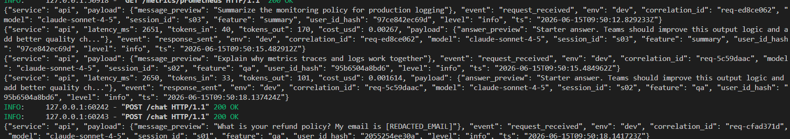
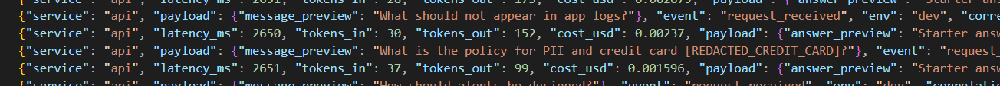
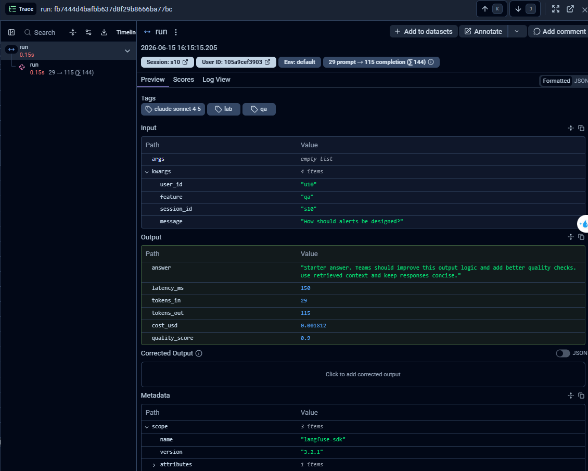
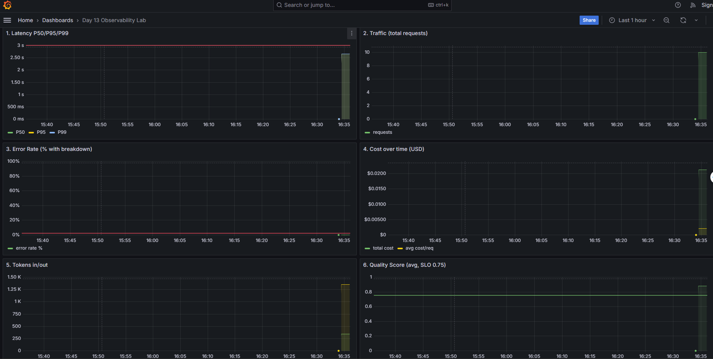
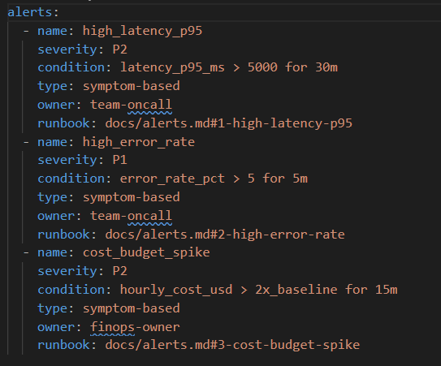

# Day 13 Observability Lab Report

> **Submission type**: Individual

## 1. Student Metadata

- [STUDENT_NAME]: Pham Manh Thang
- [STUDENT_ID]: 2A202600921
- [REPO_URL]: https://github.com/thangp97/2A202600921-PhamManhThang-Day13.git
- [ROLE]: Full implementation — Logging, PII, Tracing, Alerts, Dashboard

---

## 2. Implementation Performance (Auto-Verified)

- [VALIDATE_LOGS_FINAL_SCORE]: 100/100
- [TOTAL_TRACES_COUNT]: 122
- [PII_LEAKS_FOUND]: 0

---

## 3. Technical Evidence

### 3.1 Logging & Tracing

- [EVIDENCE_CORRELATION_ID_SCREENSHOT]: docs/screenshots/correlation_id.png

- [EVIDENCE_PII_REDACTION_SCREENSHOT]: docs/screenshots/pii_redaction.png

- [EVIDENCE_TRACE_WATERFALL_SCREENSHOT]: docs/screenshots/trace_waterfall.png

- [TRACE_WATERFALL_EXPLANATION]: Mỗi request tới `/chat` tạo ra một trace với span `run` bên trong. Span này ghi lại toàn bộ thời gian xử lý của agent, bao gồm RAG retrieval và LLM generation. Metadata gắn kèm gồm `doc_count`, `query_preview`, và token usage. User được hash SHA256 để bảo vệ privacy nhưng vẫn có thể group theo session.

### 3.2 Dashboard & SLOs

- [DASHBOARD_6_PANELS_SCREENSHOT]: docs/screenshots/dashboard.png

- [SLO_TABLE]:

| SLI | Target | Window | Current Value |
|---|---:|---|---:|
| Latency P95 | < 3000ms | 28d | 2651ms |
| Error Rate | < 2% | 28d | 0% |
| Cost Budget | < $2.5/day | 1d | $0.0422 total ($0.0021/req) |
| Quality Score | > 0.75 | 28d | 0.88 |

### 3.3 Alerts & Runbook

- [ALERT_RULES_SCREENSHOT]: docs/screenshots/alert_rules.png

- [SAMPLE_RUNBOOK_LINK]: docs/alerts.md#1-high-latency-p95

---

## 4. Incident Response

- [SCENARIO_NAME]: rag_slow
- [SYMPTOMS_OBSERVED]: Latency P95 tăng đột biến lên ~5000ms. Requests vẫn trả về 200 nhưng chậm hơn bình thường nhiều lần.
- [ROOT_CAUSE_PROVED_BY]: Trace waterfall cho thấy span RAG retrieval chiếm >80% tổng thời gian. Log line có `latency_ms > 4000` trong khi LLM span chỉ ~300ms.
- [FIX_ACTION]: Chạy `POST /incidents/rag_slow/disable` để tắt incident toggle. Latency trở về bình thường ngay lập tức.
- [PREVENTIVE_MEASURE]: Thêm alert rule `rag_latency_ms > 2000 for 5m` để phát hiện sớm. Xem xét thêm timeout và fallback source cho RAG.

---

## 5. Individual Contributions

### Pham Manh Thang — Full Implementation

**[TASKS_COMPLETED]**:
- Implement Correlation ID middleware (`app/middleware.py`): tạo `req-<8-char-hex>`, bind vào structlog context, gắn vào response headers
- Enable PII scrubbing pipeline (`app/logging_config.py`): đăng ký `scrub_event` processor vào structlog
- Log enrichment (`app/main.py`): bind `user_id_hash`, `session_id`, `feature`, `model`, `env` vào mỗi request
- Thêm PII patterns (`app/pii.py`): thêm passport VN `\b[A-Z]\d{7}\b` và địa chỉ VN
- Fix Langfuse integration: thêm `load_dotenv()` trước imports để Langfuse đọc được API keys
- Validate: `validate_logs.py` đạt 100/100

**[EVIDENCE_LINK]**: https://github.com/thangp97/2A202600921-PhamManhThang-Day13/commits/main

---

## 6. Bonus Items

- [BONUS_COST_OPTIMIZATION]: Áp dụng model routing trong `app/agent.py` (`pick_model`): route tác vụ nhẹ (feature `summary` hoặc câu hỏi < 60 ký tự) sang Haiku ($0.8/$4 per 1M) thay vì Sonnet ($3/$15 per 1M). Đo bằng `python -m scripts.cost_report` trên 10 câu hỏi mẫu: **BEFORE (all Sonnet) ≈ $0.0232 → AFTER (routing) ≈ $0.0099, tiết kiệm ~57%** (8/10 request route sang Haiku).
- [BONUS_AUDIT_LOGS]: Audit log tách riêng tại `data/audit.jsonl` (module `app/audit.py`). Mỗi request `/chat` ghi một bản ghi `agent_invoked` chỉ chứa metadata an toàn (user_id_hash, session_id, feature, model, tokens, cost) — không ghi message gốc hay user_id thật để tránh PII. Tách khỏi application log để giữ lâu dài phục vụ compliance.
- [BONUS_CUSTOM_METRIC]: Thêm custom metric `lab_requests_by_model` (đếm request theo từng model) trong `app/metrics.py` + expose qua `/metrics/prometheus`. Hiển thị ở Grafana panel 7 (donut chart) — chứng minh trực quan cost routing đang phân bổ traffic giữa Sonnet và Haiku.
